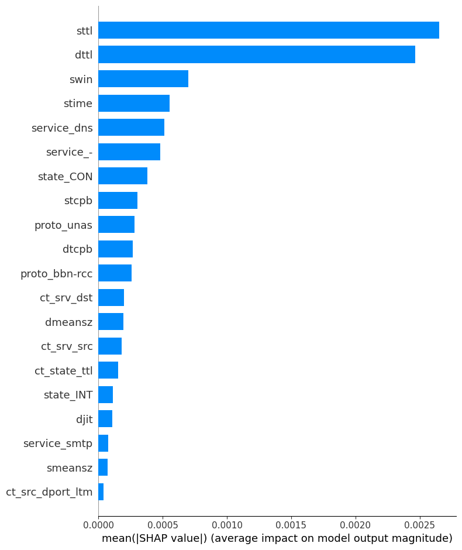

# 🔍 AE-VAE Anomaly Detection

This project evaluates and compares anomaly detection approaches on network traffic data using:

- 🧠 Deep learning methods: Autoencoder (AE), Variational Autoencoder (VAE)
- 🧪 Classical methods: Isolation Forest, One-Class SVM, Local Outlier Factor, Elliptic Envelope

> Built as a portfolio-grade, modular and reproducible data science project.

---

## 📁 Project Structure

```
ae-vae-anomaly-detection/
├── images/                 # save all plots
├── data/
│   └── README.md           # Dataset Description
├── docs/
│   ├── feature_review.md  
│   ├── experiments/
│   │     ├── ae_eval_report.md      
│   │     ├── ae_depth_comparison_report.md
│   │     ├── bottleneck_report.md
│   │     ├── ae_activation_experiment.md
│   │     ├── ae_mixed_loss_experiment.md
│   │     ├── optimizer_experiment.md
│   │     └── thresholding_comparison.md
│   ├── final_ae_experiment_report.md  
│   ├── VAE_report.md       
│   ├── AE_vs_Traditional_Report.md 
│   └── SHAP_Interpretability_Report.md 
├── notebooks/              # Jupyter notebooks by stage
│   ├── 0_draft_experiments.ipynb 
│   ├── 0_exploration_and_baseline.ipynb 
│   ├── EDA.ipynb
│   ├── Preprocess_and_TSNE.ipynb
│   ├── AE_base_model.ipynb
│   ├── experiments/
│   │    ├── AE_Depth_Comparison.ipynb
│   │    ├── Ae_Bottleneck_Experiment.ipynb
│   │    ├── Ae_activation_Experiment.ipynb
│   │    ├── ae_mixed_loss_experiment.ipynb
│   │    ├── AE_optimizer_experiment.ipynb
│   │    └── AE_Adaptive_Thresholding_experiment.ipynb
│   ├── VAE_model.ipynb
│   ├── traditional_models_with_tuning.ipy
│   └── Shap_Interpretability.ipynb
│   
├── src/
│   ├── utils/              # Reusable utility modules
│   │   ├── load_data.py    # Load raw CSV with default column names
│   │   ├── load_data.md
│   │   ├── reduce_mem.py   # Downcast dtypes to reduce memory
│   │   ├── reduce_mem.md
│   │   ├── preprocess.py   # Full preprocessing pipeline
│   │   ├── preprocess.md
│   │   ├── eda_tools.py    # EDA plotting & statistics utilities
│   │   ├── eda_tools.md
│   │   ├── tsne_vis.py     # t-SNE 2D projection tool
│   │   ├── tsne_vis.md
│   │   └── module_reload.py# Hot-reload Python modules in Colab
│   └──models/
│       ├── ae_model.py           
│       ├── ae_model.md 
│       ├── ae_evaluation.py   
│       ├── ae_evaluation.md  
│       ├── thresholding.py
│       ├── vae_model.py
│       ├── beta_vae_model.py
│       └── best_ae.h5    
│
├── requirements.txt        # List required Python packages & version
├── .gitignore              # Exclude raw/processed data, env files
└── README.md               # Project overview & usage
```

---

## 📊 Dataset

**UNSW-NB15** — A modern labeled network intrusion detection dataset.

- 47 features + `attack_cat` + binary `label`
- Mixture of normal traffic and multiple attack types
- Sampling Strategy
  - Initial experiments: 1/10 data for fast testing
  - Final AE/VAE training: full cleaned dataset (~640,000 rows)
  - All models trained on normal samples only, tested on mixed samples
- See `data/README.md` for detailed download and preparation instructions
---


## 🧰 Core Modules

This project is organized into clear functional components to enhance reproducibility and modularity:

### 🔧 `src/utils/`
Utility scripts for preprocessing, EDA, dimensionality reduction:
- `preprocess.py`: data cleaning pipeline, encoding, scaling, feature reduction
- `load_data.py`: standardized CSV loading with optional dtype control
- `reduce_mem.py`: memory optimization for large CSVs
- `tsne_vis.py`: TSNE dimensionality reduction for visualization
- `eda_tools.py`: helper functions for EDA and summary stats

### 🤖 `src/models/`
Core model definitions and training utilities:
- `ae_model.py`: AutoEncoder model builder (depth, activation, dropout adjustable)
- `vae_model.py`: VAE model builder 
- `beta_vae_model.py`: β-VAE implementation with KL tuning and warm-up
- `ae_evaluation.py`: evaluation utilities, visualizations, and reporting
- `thresholding.py`: percentile/F1 threshold strategies

Each model module is independently testable and documented inline.


## 📓 Notebooks

All notebooks are stored in the [`notebooks/`](./notebooks) folder and organized for each stage:

| Notebook | Description |
|----------|-------------|
| `0_draft_experiments.ipynb` | The very first draft version of this project |
| `0_exploration_and_baseline.ipynb` | A more structured and organized version of the original baseline |
| `🔺EDA.ipynb` | Exploratory data analysis, feature distribution, rare category check |
| `🔺Preprocess_and_TSNE.ipynb` | Preprocessing pipeline, scaling, encoding, and latent space visualization |
| `🔺AE_base_model.ipynb` | Shallow AE structure, training, loss curves, evaluation |
| `🔺experiments/` | 6 controlled AE model experiments on depth, bottleneck size, activations, loss functions, optimizers, thresholds |
Each experiment is separately documented and reproducible.
| `🔺VAE_model.ipynb` | VAE and β-VAE models with KL warm-up and visualization |
| `🔺Shap_Interpretability.ipynb` | SHAP analysis for best AE model interpretability |
| `🔺traditional_models_with_tuning.ipynb` | Baseline classical models: One-Class SVM, LOF, Isolation Forest, Elliptic Envelope and evaluation|
---

## 🔬 Models and Experiments

The goal is to design and evaluate anomaly detection models under a robust framework. Models evaluated include:

### ✅ AutoEncoder (AE)

Try basic AE model first, then design 6 experiments below to refine it
- Shallow & Deep AE comparison
- Bottleneck dimension sweep (4, 8, 16, 32)
- Activation comparison: ReLU, Tanh, ELU, SELU, LeakyReLU
- Loss strategies: standard MSE vs. mixed loss
- Optimizers: Adam, AdamW, SGD
- Thresholding: Percentile-based, F1-maximization

📊 **Best AE Result**  
F1 = 0.7527 | AUC = 0.9907 (Shallow AE, tanh, bottleneck=16, AdamW)

### ✅ Variational AutoEncoder (VAE)

- Basic VAE
- KL divergence weighting (`β`-VAE)
- KL annealing (warm-up strategy)

❌ Paused further optimization on the VAE series because they underperformed compared to AE on this dataset

### 🆚 Traditional Models

- One-Class SVM, Isolation Forest, Local Outlier Factor, Elliptic Envelope
- Trained on **normal-only samples**, validated on mixed data
- AE consistently outperformed all classical methods in F1/AUC

---
## 🔍 SHAP Interpretability

To better understand the behavior of the trained AutoEncoder (AE) model, I employed **SHAP (SHapley Additive exPlanations)** to provide insights into which input features most influence anomaly scores.

### ❓ Why SHAP?

SHAP is a unified approach to explain the output of any machine learning model. It computes the contribution of each feature by considering all possible combinations of features. In the context of anomaly detection, this allows us to:

- Identify which features contribute most to reconstruction errors
- Investigate what drives anomalous vs. normal behavior
- Build trust and transparency into the model’s decisions

### 📈 Summary Plot

The SHAP summary plot ranks features by average impact and shows how high/low values of each feature affect anomaly detection. Here is the summary plot for our final selected AE model:


### Workflow

- A subset of **anomalous** samples was selected for explanation
- SHAP values were computed using a background sample from normal data
- We visualized global importance using summary and bar plots

SHAP results demonstrated the AE model's ability to focus on semantically meaningful indicators of attack behavior.

> 📁 For detailed SHAP plots and explanation workflow, see `notebooks/Shap_Interpretability.ipynb`.

## 🏁 Final Results: AE vs Traditional Methods

After a series of architectural, training, and loss function optimizations, the final AutoEncoder (AE) model was selected based on its balanced performance across precision, recall, and F1 score.

### 📊 Final AE Performance
| Metric        | Value     |
|---------------|-----------|
| Precision     | 0.60896   |
| Recall        | 0.98529   |
| F1 Score      | 0.75271   |
| ROC AUC       | 0.99079   |
| TP / FP / TN / FN | 2814 / 1807 / 123495 / 42 |

### 🧪 Traditional Methods Performance Comparison

| Method              | Precision | Recall  | F1 Score | ROC AUC | Notes |
|---------------------|-----------|---------|----------|---------|-------|
| **One-Class SVM**   | 0.55390   | 0.54517 | 0.54950  | 0.76758 | Tuned with GridSearch |
| **Isolation Forest**| 0.32598   | 0.21218 | 0.25705  | 0.60109 | Weak performance overall |
| **Elliptic Envelope** | 0.43888 | 0.34069 | 0.38360  | 0.66538 | Assumes Gaussian |
| **Local Outlier Factor** | 0.55393 | 0.54307 | 0.54844 | 0.76655 | Unsupervised fit on normal only |

The AE model **outperforms all traditional models** across all major metrics.

## 🔭 Future Work

This project lays a strong foundation for applying Autoencoder (AE) and Variational Autoencoder (VAE) models to network anomaly detection. Based on current results and limitations, several future directions are planned:

- **Custom Loss Functions**: Explore more advanced loss functions such as perceptual loss or feature-level reconstruction to better capture anomaly structure.
- **Model Fusion**: Investigate the combination of AE/VAE outputs with traditional anomaly detection scores (e.g., One-Class SVM) using ensemble techniques.
- **Generalization to Other Datasets**: Validate the current model pipeline on diverse cybersecurity datasets (e.g., CICIDS2017, NSL-KDD).
- **Online or Continual Learning**: Extend the AE/VAE to adapt in real-time or on streaming network traffic.
- **Time-Series Modeling**: Incorporate sequential architectures like LSTM-AE or Transformer-based VAE for traffic behavior modeling.
- **End-to-End Deployment**: Design a lightweight model variant suitable for deployment in real-time intrusion detection systems (IDS).

These directions aim to improve performance, robustness, interpretability, and deployment-readiness of deep anomaly detection models in real-world security settings.

---

## 👩‍💻 Author

Created by [Shiyu Cai] · Portfolio Project  
> *Feel free to fork, study or reuse parts of this repo in your own data science learning path.*