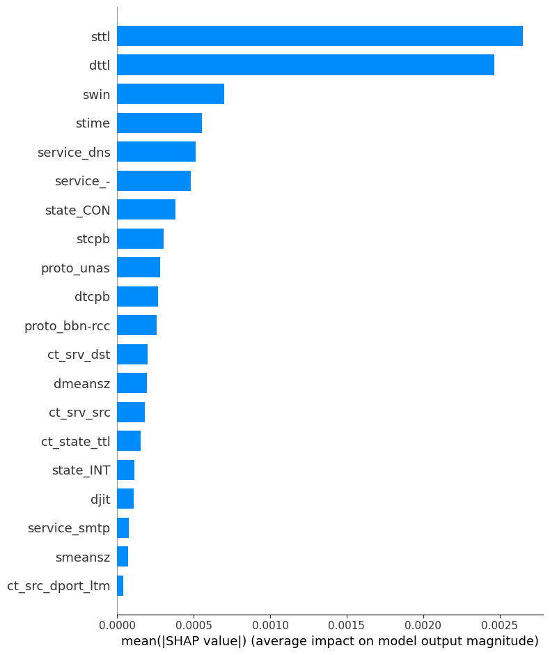

# SHAP-Based Interpretability Analysis of the Final AutoEncoder

## Overview

This report summarizes the interpretability analysis of the optimized AutoEncoder (AE) model using SHAP (SHapley Additive exPlanations). The analysis focuses on identifying the most influential features driving anomaly detection decisions.

---

## 1. Global Feature Importance

The SHAP bar plot shows the mean absolute SHAP value for each input feature, indicating its average contribution to the AE model’s reconstruction error. Here is the summary plot for our final selected AE model:

- **Top features** with the highest impact:
  - `sttl`
  - `dttl`
  - `swin`
  - `stime`
  - `service_dns`

> These features play a crucial role in determining whether a sample is reconstructed poorly (i.e., flagged as anomalous).

---

## 2. Local Feature Attribution (Force Plot)

The SHAP force plot explains the decision for a single test sample:

- **Red segments** indicate features pushing the model output toward higher anomaly score (more anomalous).
- **Blue segments** indicate features pushing toward a lower score (more normal).
- The **final predicted anomaly score** for this sample is approximately **0.01**.

> Example: `sloss`, `bytes`, and `state_CON` increase the anomaly score, while `dttl`, `stime`, and `service_dns` reduce it.

---

## Insights

| View | Type | Purpose | Best Use Case |
|------|------|---------|---------------|
| Bar Plot | Global | Ranks feature influence overall | Feature selection, understanding model |
| Force Plot | Local | Explains specific predictions | Root-cause analysis, case review |

---

## Conclusion

SHAP effectively reveals which features most strongly influence the AE model's anomaly decisions, providing actionable insights for feature engineering and domain analysis.