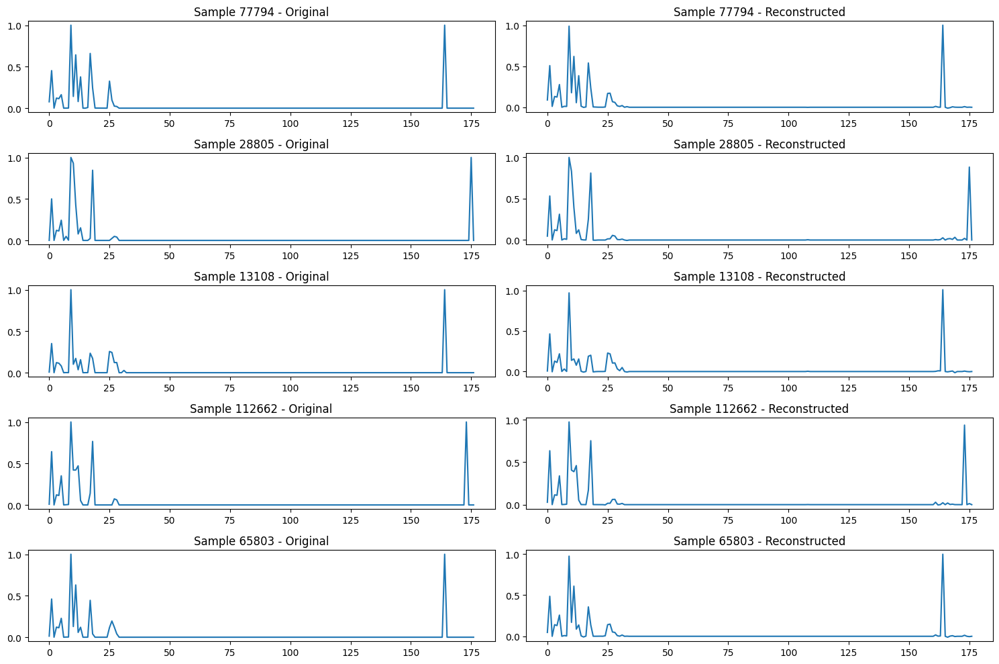

# Autoencoder Depth Comparison Report

## Overview

This report presents a comparison between a **Shallow Autoencoder** and a **Deep Autoencoder** trained on the full UNSW-NB15 dataset after preprocessing. The goal is to evaluate how encoder/decoder depth affects reconstruction performance and anomaly detection effectiveness.

---

## 1. Training Curves

**Shallow AE Training Loss & MAE:**

**Deep AE Training Loss & MAE:**

---

## 2. Reconstruction Visualization

**Shallow AE Reconstruction Samples:**

**Deep AE Reconstruction Samples:**

---

## 3. Quantitative Evaluation

### 📊 Shallow AE

- **Precision:** 0.5591
- **Recall:** 0.6208
- **F1 Score:** 0.5884
- **ROC-AUC:** 0.9868
- **Threshold:** 0.00363

**Confusion Matrix:**
- TP: 1773
- FP: 1398
- TN: 123904
- FN: 1083

---

### 📊 Deep AE

- **Precision:** 0.6162
- **Recall:** 0.5154
- **F1 Score:** 0.5613
- **ROC-AUC:** 0.9786
- **Threshold:** 0.00389

**Confusion Matrix:**
- TP: 1472
- FP: 917
- TN: 124385
- FN: 1384

---

## 4. Conclusion

- The **Shallow AE** achieved **higher recall** and **slightly better F1**, making it more effective in capturing anomalies.
- The **Deep AE** had **higher precision** and fewer false positives but missed more anomalies.
- ROC-AUC is strong for both, indicating good separability.

> Recommendation: Favor **Shallow AE** for higher anomaly coverage (recall), unless false positives must be minimized.

---

## 5. Next Steps

- Try other architectural variants: intermediate-depth or residual AE.
- Explore additional improvements: regularization, learning rate tuning, or hybrid models.
