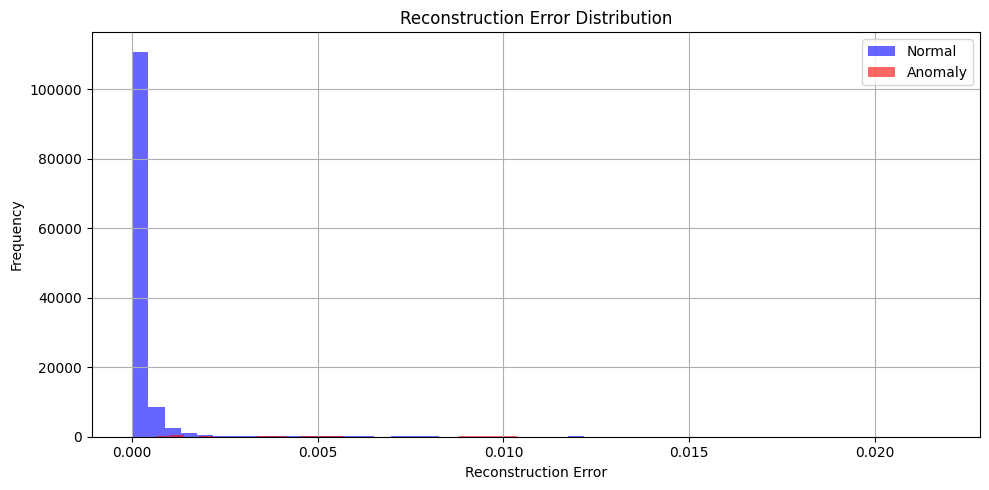
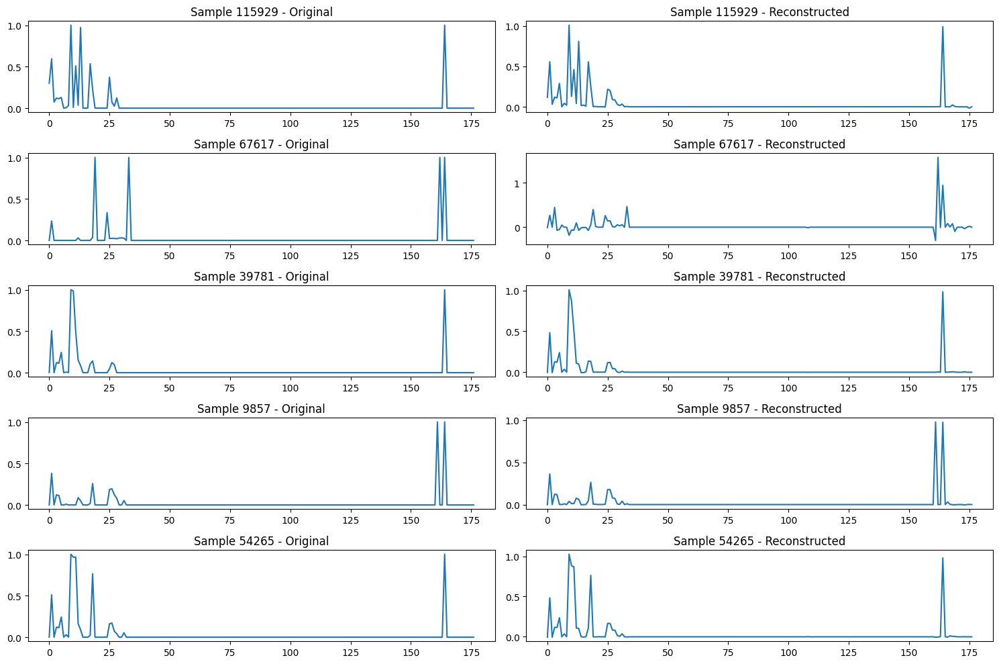

# 🧪 Autoencoder Evaluation Report

**Date:** 2025-05-09  
**Model:** Basic Autoencoder  
**Dataset:** UNSW-NB15 (cleaned subset)  
**Samples:** 640,788   
**Features:** 178

---

## ✅ Evaluation Metrics

| Metric        | Value     |
|---------------|-----------|
| Precision     | 0.5819    |
| Recall        | 0.6334    |
| F1 Score      | 0.6065    |
| ROC AUC       | 0.9847    |

### Confusion Matrix

|        | Pred: Normal | Pred: Anomaly |
|--------|--------------|----------------|
| **Actual: Normal** | TN = 124,002   | FP = 1,300         |
| **Actual: Anomaly**| FN = 1,047       | TP = 1,809       |

---

## 📈 Reconstruction Error Distribution

- **Normal samples**: mostly low error, tight cluster near zero
- **Anomalies**: higher reconstruction errors, right-shifted tail
- **Threshold**: 0.00367 chosen via F1 score optimization

---

## 🧩 Sample Reconstructions

- 5 randomly selected samples plotted (Original vs Reconstructed)
- Most samples show:
  - Good preservation of shape
  - Accurate reconstruction of high-value peaks
- Some deviations indicate potential anomaly learnability

---

## 📌 Analysis Summary

- Base AE model **can not successfully detects majority of anomalies** (recall 63.34%)

---

## 🛠️ Recommendations

- Start AE model structure experiments

---

## 🔗 Visuals

- `ae_training_plot.png`: Loss/MAE curve  
- `recon_error_hist.png`: Reconstruction error distribution  
- `reconstructed_samples.png`: Input vs Output plots

---
